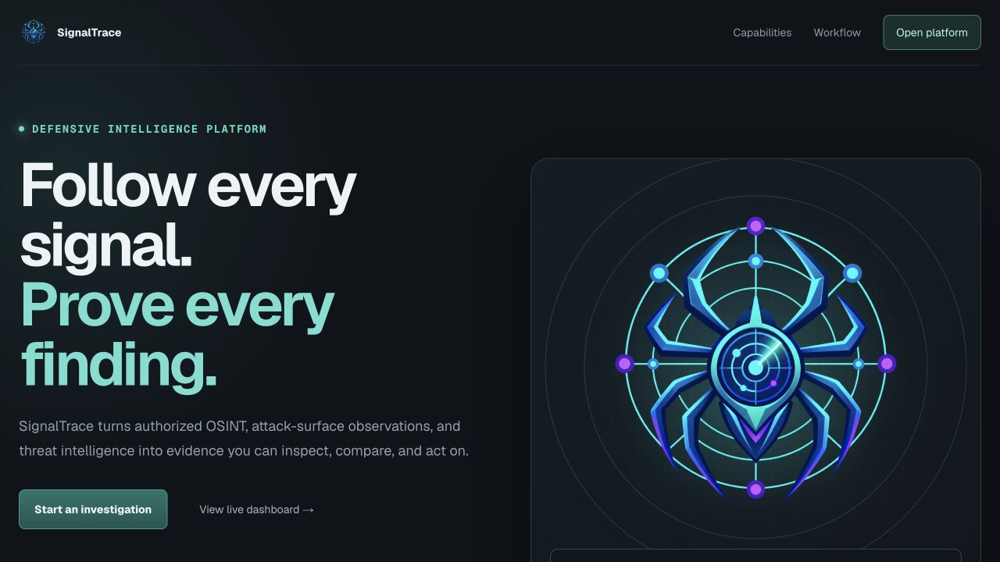
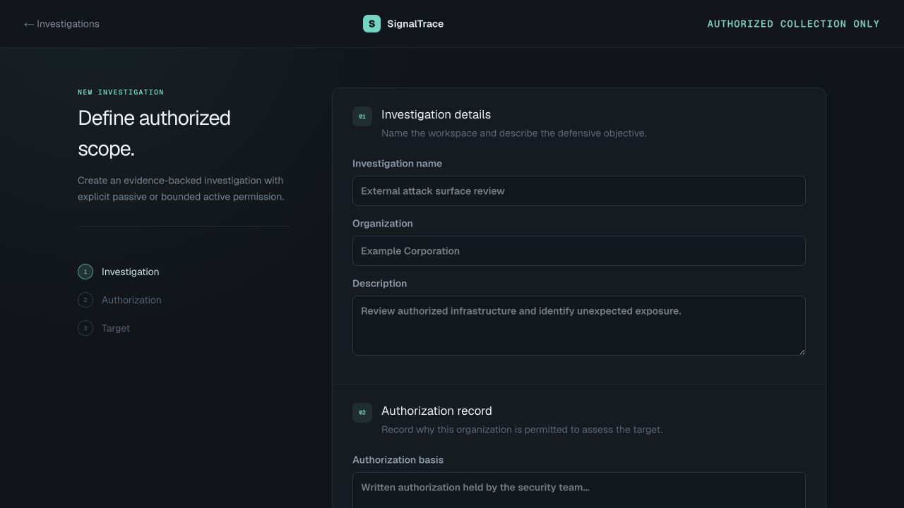

# SignalTrace Tutorial: From External Exposure to Verified Remediation

SignalTrace is a local-first cyber-intelligence operations platform. It is designed to help an authorized analyst discover what the public Internet can learn about an organization, connect those observations into evidence-backed findings, understand how exposure could contribute to an attack path, and prove that remediation changed the observable state.

This tutorial teaches two complementary viewpoints:

- **Defensive viewpoint:** What do we own, what is exposed, what evidence supports the risk, what should we fix, and how do we prove the fix?
- **Authorized offensive viewpoint:** What could an unauthenticated external observer discover, which observations reduce uncertainty for an attacker, and which combinations of exposure deserve defensive attention?

The offensive viewpoint is a way to improve defense. It does not authorize access, exploitation, credential use, disruption, or testing outside recorded scope.



## 1. Learning objectives

After completing this tutorial, you should be able to:

1. Start SignalTrace and verify that its core services are healthy.
2. Define an investigation with a precise authorization record.
3. Distinguish a target, entity, relationship, evidence source, finding, claim, and analysis snapshot.
4. Choose passive, local, credentialed, and active providers deliberately.
5. Run collection jobs and interpret their durable job states.
6. Read the evidence graph without treating correlation as proof of compromise.
7. Evaluate exposure from both attacker and defender perspectives.
8. Prioritize findings using severity, confidence, exploitability context, business impact, and evidence freshness.
9. Rescan an asset, compare evidence, and manage the finding lifecycle.
10. Produce a report that separates observed facts, derived analysis, limitations, and recommendations.

## 2. The operating model

SignalTrace is not a single scanner. It is an evidence system that coordinates multiple collectors and analysis steps.

```text
Authorization
    ↓
Targets and collection policy
    ↓
Durable provider jobs
    ↓
Raw/redacted source evidence
    ↓
Normalized entities and relationships
    ↓
Evidence-backed findings and change records
    ↓
Risk analysis, analyst decisions, remediation, and reports
    ↓
Rescan and comparison
```

The order matters. A conclusion should never exist without a target, authorization record, source, and collection event behind it.

### 2.1 Core data concepts

| Concept | Meaning | Example |
| --- | --- | --- |
| Investigation | The bounded case or workspace | “External attack surface — Q3” |
| Authorization | Why and how the target may be assessed | Written approval for a company-owned domain |
| Target | An exact input the analyst is allowed to investigate | `example.com`, an IP address, username, repository, image, or SBOM |
| Job | A durable request to run one provider against one target | DNS discovery for an authorized domain |
| Evidence source | Provider output and provenance retained by SignalTrace | A DNS answer with provider and collection time |
| Entity | A normalized object discovered in evidence | Domain, IP, certificate, service, identity, package, or indicator |
| Relationship | A source-backed connection between entities | Domain resolves to IP; certificate contains domain |
| Finding | An actionable security condition | Unexpected public service or missing security control |
| Claim | A statement tied to evidence | “Provider X observed service Y on asset Z” |
| Analysis snapshot | A point-in-time risk calculation and recommendation set | Risk 45/100 based on current active findings |
| Evidence change | A difference between collection snapshots | A service disappeared, a certificate changed, or a new record appeared |

### 2.2 Observation is not compromise

SignalTrace deliberately separates three levels of reasoning:

- **Observed fact:** A provider returned a value, a service answered, or a control was absent at collection time.
- **Derived analysis:** Multiple observations suggest a security-relevant pattern.
- **Hypothesis:** A possible explanation that still requires validation.

For example, an Internet-facing service and a threat-intelligence record may coexist in the same investigation. That is useful prioritization context, but co-occurrence does not prove that the service is compromised or that the threat record relates to the asset.

## 3. Defense and offense as complementary concepts

### 3.1 Defensive questions

A defender uses SignalTrace to ask:

- Is the asset expected and owned?
- Is the exposure intended?
- Is the configuration consistent with policy?
- Is the observation current and reproducible?
- What evidence supports the finding?
- What is the likely impact on confidentiality, integrity, or availability?
- Which team owns the fix?
- Did the observable condition disappear after remediation?

### 3.2 Authorized offensive questions

An external observer thinks in terms of uncertainty reduction:

- Which domains and subdomains identify systems or environments?
- Which addresses and services reveal technology or management surfaces?
- Which certificates, DNS records, repositories, usernames, or package metadata reveal relationships?
- Which naming patterns suggest staging, development, administration, backups, or legacy systems?
- Which weak signals become important when combined?
- Which asset appears easiest to investigate further?

This perspective does **not** mean “launch an exploit.” It means understanding how public evidence helps an attacker select and profile a target so the defender can remove unnecessary exposure, strengthen controls, and improve detection.

### 3.3 The defender–observer translation

| External observation | Offensive interpretation | Defensive response |
| --- | --- | --- |
| New subdomain | Possible new application or forgotten environment | Confirm ownership, purpose, authentication, patching, and monitoring |
| Public service | Potential entry point or fingerprinting source | Confirm business need, restrict reachability, harden, patch, and log |
| Certificate name | Infrastructure relationship or hidden hostname | Review certificate scope and unintended naming disclosure |
| Missing web header | Browser-side protection may be weaker | Validate application behavior and deploy the appropriate header safely |
| Repository secret finding | Credential may be recoverable from source history | Revoke first, remove exposure, inspect use, then prevent recurrence |
| Threat-feed match | Indicator has outside security context | Validate indicator type, age, source reliability, and asset relationship |
| Domain look-alike | Possible impersonation or phishing preparation | Review registration, content, mail controls, brand monitoring, and takedown options |
| Changed DNS or service | Attack surface changed | Confirm change ticket, owner, expected state, and security controls |

## 4. Start and verify SignalTrace

Clone and start the platform:

```bash
git clone https://github.com/JedidiahBowlding/SignalTrace.git
cd SignalTrace
python3 scripts/setup.py --start
```

Windows PowerShell uses the Python launcher:

```powershell
git clone https://github.com/JedidiahBowlding/SignalTrace.git
Set-Location SignalTrace
py scripts/setup.py --start
```

Verify the stack:

```bash
docker compose ps
curl --fail http://localhost:8000/health/ready
python3 scripts/doctor.py
```

The API is healthy when it returns:

```json
{"status":"ready"}
```

Open `http://localhost:3000`. The API documentation is at `http://localhost:8000/api/docs`.

### 4.1 What healthy means

A healthy core installation has:

- A reachable frontend.
- A ready API.
- A running worker capable of leasing durable jobs.
- A healthy PostgreSQL database.
- A reachable local TAXII service.
- Optional providers clearly shown as ready, unconfigured, disabled, or unavailable.

“Provider unavailable” does not mean the platform is broken. Optional tools and commercial intelligence services should remain unavailable until their dependencies or credentials are configured.

## 5. Configure providers safely

Open **Settings**. Provider configuration is organization-specific and persists across restarts.

### 5.1 Credential behavior

- Provider credentials are submitted to the local API.
- SignalTrace encrypts provider secrets at rest using the locally configured provider-encryption key.
- Saved-provider cards show whether credentials are stored without returning the secret value.
- The browser should not display a stored API key after saving.
- Credentials remain available to the organization after restart; they are not re-entered for every scan.
- Never paste credentials into screenshots, issues, logs, test fixtures, or Git commits.

If a credential may have been exposed, revoke it at the provider, create a replacement, update SignalTrace, and review the provider’s access history.

### 5.2 Provider control plane

Each provider can have:

- **Enabled state:** Whether jobs may be queued.
- **Kill switch:** Immediate operational stop for that provider.
- **Jobs per hour:** Rate boundary.
- **Timeout:** Maximum provider execution time.
- **Failure threshold:** Consecutive failures before opening the circuit.
- **Cooldown:** How long the provider waits before recovery is attempted.

These controls prevent a broken or rate-limited provider from producing an uncontrolled retry loop.

### 5.3 Provider categories

| Category | Examples implemented in SignalTrace | Primary purpose |
| --- | --- | --- |
| Safe validation | `safe_mock` | Test jobs, evidence, relationships, and UI without external collection |
| Passive discovery | `dns_discovery`, `certificate_transparency`, `domain_security`, `rdap` | Learn public domain and registration posture |
| Web posture | `web_posture`, `testssl`, `zap_passive` | Inspect externally visible web/TLS behavior |
| Threat intelligence | VirusTotal, Shodan, GreyNoise, OTX, AbuseIPDB, Censys, URLhaus, abuse.ch | Add provider context to domains, IPs, URLs, and indicators |
| Identity | `public_identity`, Maigret, HIBP | Correlate authorized public identity and exposure signals |
| Discovery/local tools | Subfinder, httpx, Naabu, Nmap, RustScan, Masscan, Nuclei, Katana, dnstwist, Nikto | Perform installed-tool workflows subject to provider policy and authorization |
| Source and supply chain | Gitleaks, TruffleHog, Semgrep, OSV-Scanner, Checkov, Syft, Grype, Trivy | Inspect authorized repositories, images, packages, and SBOMs |
| Vulnerability assessment | OpenVAS/Greenbone, ZAP active | Approved active assessment with additional controls |
| Structured intelligence | TAXII/STIX | Import and correlate trusted indicator collections |

Availability depends on target type, installed dependencies, credentials, organization settings, and authorization. The workspace only lists providers that are usable for the selected target.

## 6. Create an authorization-first investigation

Choose **New investigation**.



### Step 1: Investigation details

Use a name that communicates purpose and time boundary, such as:

```text
Corporate external exposure — August 2026
```

The description should state the defensive objective, not merely repeat the target:

```text
Identify unintended public services and domain changes, validate expected web posture,
and establish a baseline for remediation tracking.
```

### Step 2: Authorization record

Record the basis precisely:

- Asset owner or authorizing organization.
- Approval reference or ticket.
- Assessment window.
- Allowed target types and ranges.
- Passive-only or bounded active permission.
- Prohibited actions.
- Emergency contact and stop condition when appropriate.

Weak authorization text such as “I have permission” is hard to audit. Prefer a traceable statement such as:

```text
Approved under security ticket SEC-1234 by the infrastructure owner for passive
collection against example.com and exact-IP service verification against the listed
company addresses through 2026-09-15. Denial-of-service and credential testing excluded.
```

### Step 3: Initial target

Choose the correct type. Canonicalization and provider eligibility depend on it.

- **Domain:** `example.com`, not a full page URL.
- **IP address:** An exact authorized public IP.
- **URL:** A complete authorized web URL.
- **ASN:** An explicitly owned or approved autonomous system.
- **Email, person, username, organization:** Only for legitimate defensive identity work.
- **Repository:** An authorized local path or GitHub repository.
- **Container image or SBOM:** An artifact you are permitted to assess.

“Include discovered descendants” records newly discovered assets for analyst review. It does not silently grant active authorization over those assets.

## 7. Safe hands-on lab

Use this lab before connecting real providers.

1. Create an investigation named **SignalTrace training lab**.
2. Use organization **Training**.
3. Record that the exercise uses synthetic evidence only.
4. Select target type **Domain** and target `example.com`.
5. Leave active service observation disabled.
6. Create the investigation.
7. In **Run collection**, select `example.com` and **safe mock**.
8. Click **Run safe mock**.
9. Open **Jobs** and watch the job transition.
10. Open **Graph**, select nodes, and inspect their provider and confidence fields.

The safe mock provider is intentionally synthetic. It proves that authorization, queuing, worker execution, normalization, graph creation, analysis, and UI rendering work without contacting a real intelligence provider.

## 8. Run a real authorized collection

For an asset you own or are explicitly authorized to assess:

1. Select the exact target in **Run collection**.
2. Select one provider.
3. Read the provider name and mode carefully.
4. Confirm that the provider is ready.
5. Click **Run _provider_**.
6. Use the confirmation message to open **Jobs**.

Start with passive providers. A useful domain baseline is:

1. DNS discovery.
2. Certificate transparency.
3. Domain security.
4. RDAP.
5. Web posture.
6. Threat-intelligence enrichment for the resulting domain and authorized IP targets.

Use **Run all ready** only after reviewing which providers are ready for the selected target. “Ready” means operationally available; it does not replace the analyst’s responsibility to confirm scope and provider behavior.

### 8.1 Passive versus active collection

| Mode | What it means | Analyst decision |
| --- | --- | --- |
| Synthetic | No external provider is contacted | Safe for functional validation |
| Passive/public-data | Queries public records or an intelligence provider | Confirm target and provider terms |
| Direct observation | Connects to an exact authorized asset | Requires bounded active authorization where enforced |
| Active assessment | Sends assessment traffic intended to test behavior | Requires explicit approval, change awareness, and provider-specific confirmation |

ZAP active requires an additional confirmation in the workspace. This is deliberate friction. Never treat a responsive URL, discovered hostname, or third-party hosting address as automatic permission for active testing.

## 9. Understand durable jobs

Collection is asynchronous. Clicking **Run** queues work; it does not guarantee an immediate result.

Common states include:

- **Queued:** Accepted and awaiting a worker lease.
- **Running:** A worker has leased the job and is sending heartbeats.
- **Completed:** Execution ended successfully; inspect the result count and evidence.
- **Failed:** Execution stopped with an error summary.
- **Cancelled:** An analyst cancelled queued or running work.

Jobs have bounded attempts, timeouts, leases, and event history. A worker interruption does not require the UI to pretend the scan completed. Use the execution timeline to distinguish “button did nothing” from queued work, provider delay, circuit breaker, timeout, or failure.

When a job fails, check in this order:

1. Was the provider enabled?
2. Were required credentials saved?
3. Is the provider installed and healthy?
4. Does it support the selected target type?
5. Did authorization permit the provider’s mode?
6. Is the provider circuit open after repeated failures?
7. Did the provider return a rate-limit or authentication error?
8. Do `docker compose logs -f worker` and `docker compose logs -f api` explain the failure?

## 10. Read the investigation workspace

### Overview

Use Overview to see authorized scope, collection controls, analysis, provider-specific summaries, and the latest evidence-backed findings.

### Graph

The graph shows normalized entities and source-backed relationships. Use it to answer:

- Which entity is the original target?
- Which nodes came from which provider?
- Which relationships are direct observations versus inferred connections?
- Does one IP support several hostnames?
- Does one certificate connect otherwise separate domains?
- Which nodes have low confidence or synthetic provenance?

Select a node to inspect its type, canonical value, provider, confidence, and evidence classification. Filter entity types to reduce visual noise. Use **Fit graph** after filtering or panning.

An edge means “SignalTrace has evidence for this relationship.” It does not necessarily mean ownership, malicious control, or compromise.

### Entities

Entities are deduplicated normalized objects. Compare:

- Canonical value.
- Entity type.
- Provider.
- Confidence.
- Attributes and collection time.

Multiple providers supporting the same entity can increase confidence, but providers can share upstream data. Apparent corroboration is not always independent corroboration.

### Relationships

Relationships explain why two entities appear together. Ask whether the relationship is:

- Current or historical.
- Directly observed or derived.
- Strong enough to change a finding.
- Expected by the asset owner.

### Jobs

Jobs provide operational truth: what ran, when, how many attempts occurred, how many results were created, and whether the worker completed the task.

### Monitoring

Monitoring schedules the selected provider and target at a defined interval. Changes are stored separately from current evidence so history is not overwritten.

## 11. Threat-intelligence interpretation

Threat intelligence adds context; it does not provide an automatic verdict on ownership or compromise.

### VirusTotal

SignalTrace can preserve verdict counts and malware associations. Interpret them carefully:

- A malicious count is a provider observation, not a complete incident conclusion.
- Check the indicator type and exact canonical value.
- Review freshness and whether the provider record predates your ownership.
- Separate a domain verdict from a URL verdict and an IP verdict.
- Shared hosting can create misleading IP-level context.

### AlienVault OTX

OTX pulse matches show that an indicator appears in one or more community intelligence collections. Review pulse relevance, date, author context, indicator type, and overlap. A pulse match should lead to validation, not automatic blocking.

### Censys and Shodan

These services describe Internet-observed hosts and services. Their data may lag behind a recent firewall or service change. Use them to understand what an external index observed, then use a fresh authorized rescan and direct infrastructure validation to confirm current state.

### GreyNoise and AbuseIPDB

Reputation context can help distinguish widespread scanning activity from more targeted attention. Reputation records describe observed behavior associated with an IP, not necessarily the current intent or every user behind that address.

### URLhaus and abuse.ch ThreatFox

Matches can reveal malware-delivery URLs, threat records, families, or related indicators. Validate the exact indicator, record age, status, and relationship to the investigated asset.

## 12. Findings and vulnerability guidance

A useful finding answers six questions:

1. **What was observed?**
2. **Where was it observed?**
3. **Which source supports it?**
4. **Why does it matter?**
5. **How should it be fixed?**
6. **How will the fix be verified?**

SignalTrace’s vulnerability help explains a plausible attack consequence and remediation when you hover the help control. Treat this as defensive context, not proof that exploitation occurred.

### 12.1 Example: unexpected public service

**Observation:** An external provider reports a service on an authorized public IP and port.

**Offensive interpretation:** A public service gives an observer a protocol, product, or management surface to profile. If unnecessary, outdated, weakly authenticated, or broadly reachable, it can become part of an attack path.

**Defensive validation:**

- Confirm that the IP belongs to the organization.
- Identify the system and service owner.
- Confirm whether the service is required from the public Internet.
- Compare cloud firewall, host firewall, load balancer, NAT, and service configuration.
- Check current service telemetry and an approved fresh observation.
- Determine whether the provider result is historical.

**Remediation:** Remove the service, bind it to a private interface, restrict source networks, place it behind an approved access layer, harden authentication, patch the implementation, and add monitoring as appropriate.

**Verification:** Rescan with the same provider, compare evidence time and status, and verify configuration at the source. A stale third-party index alone should not keep a remediated finding open forever; record the limitation and wait for index refresh or use an approved current observation.

### 12.2 Example: missing web security control

**Observation:** Web posture collection does not observe an expected control.

**Offensive interpretation:** Missing browser protections can make another application flaw easier to use or increase impact.

**Defensive validation:** Confirm the final response after redirects, test representative routes, account for CDN/proxy behavior, and decide whether the control is applicable to the application.

**Remediation:** Configure the control at the correct application, reverse proxy, or CDN layer; test compatibility; deploy gradually where breakage is possible.

**Verification:** Collect web posture again and inspect the exact response evidence. Do not close the finding merely because a configuration file changed.

## 13. Risk score explained

In SignalTrace, **higher numbers mean more risk**. The score is evidence-prioritization logic, not a probability of breach and not a replacement for business judgment.

The current analysis assigns active findings these weights:

| Severity | Weight |
| --- | ---: |
| Critical | 35 |
| High | 25 |
| Medium | 15 |
| Low | 5 |
| Informational | 1 |

It then adds:

- Up to 15 points for unacknowledged evidence changes, at 3 points each.
- Up to 25 points for malicious threat-intelligence records, at 10 points each.
- A hard cap of 100.

Risk levels are:

| Score | Level |
| ---: | --- |
| 0–29 | Low |
| 30–59 | Medium |
| 60–79 | High |
| 80–100 | Critical |

Open and acknowledged findings count. A risk-accepted finding counts again after its exception expires. Resolved findings should not continue to contribute as active findings.

### 13.1 What the score does not know

The numeric score cannot fully know:

- Asset criticality.
- Data sensitivity.
- Compensating controls.
- Internet reachability beyond the collected evidence.
- Whether a threat record truly relates to the asset.
- Exploit reliability.
- Business impact and recovery capability.

Use it to prioritize review, then document the human decision.

## 14. Evidence-based analysis and AI narrative

After collection completes, generate a new analysis snapshot. If the UI says new scan evidence is available, the current analysis predates the latest completed job and should be regenerated.

The deterministic analysis produces:

- Risk score and level.
- Metrics.
- Observed claims tied to finding or entity identifiers.
- Derived correlations with stated limitations.
- Evidence-linked recommendations.

The AI narrative is secondary. It should summarize the existing evidence and analysis, not invent new facts. Before sharing a narrative, verify:

- Every important statement has evidence.
- Historical data is not described as current.
- Shared infrastructure is not described as owned without proof.
- Co-occurrence is not described as causation.
- Provider errors and blind spots are disclosed.
- Recommendations match the actual asset and control owner.

When evidence changes, regenerate both the analysis and narrative. Updating the scan does not automatically make an older narrative current.

## 15. Finding lifecycle management

A mature workflow does not repeatedly rediscover the same issue without ownership or closure.

Typical states include:

- **Open:** Evidence indicates the condition currently requires action.
- **Acknowledged:** An analyst has reviewed it, but remediation is incomplete.
- **Risk accepted:** An authorized decision accepts the condition until a documented expiration.
- **Resolved:** Remediation and verification support closure.
- **Recurring:** A previously resolved condition returned in newer evidence.

For each finding, record:

- Owner.
- Remediation action.
- Due date or review date.
- Evidence references.
- Exception reason and expiration, if accepted.
- Verification method.
- Residual risk.

Do not mark a finding resolved merely because a ticket was closed or a configuration change was requested. Resolution requires verification evidence.

## 16. Rescanning and proving the fix

Use the same investigation when you want continuity and historical comparison.

1. Confirm the remediation was deployed.
2. Select the same canonical target.
3. Select the provider that created the relevant evidence.
4. Run the provider again.
5. Watch the job reach **Completed**.
6. Review new evidence timestamps.
7. Open Monitoring and inspect evidence changes.
8. Regenerate risk analysis.
9. Review whether the finding is resolved, unchanged, or recurring.
10. Record configuration-side proof where external providers are stale.

A new workspace creates a fresh case, but it is usually worse for remediation tracking because it separates old and new evidence. Create a new investigation when scope, authorization, organization, engagement period, or reporting boundary genuinely changed.

## 17. Scheduled monitoring

Monitoring repeatedly runs one provider against one target.

Choose an interval based on risk and provider limits:

- Five minutes is useful for a short controlled test, not a default for commercial APIs.
- Hourly can support high-value change detection.
- Daily is a reasonable attack-surface baseline for many assets.
- Weekly can suit slow-changing registration or certificate context.

The monitoring view shows enabled/paused schedules, next-run time, and evidence-change alerts. Acknowledge a change only after deciding whether it is expected, benign, risky, or requires a finding.

Good change questions include:

- Was a new asset or service intentionally deployed?
- Did a control disappear?
- Did ownership or routing change?
- Did a certificate introduce an unexpected name?
- Did a provider’s data model change rather than the asset?
- Is the difference caused by timeout, rate limiting, or partial collection?

## 18. Reporting

Generate analysis before exporting a report. A strong report contains:

1. Scope and authorization.
2. Collection period and provider coverage.
3. Executive risk summary.
4. Evidence-backed findings.
5. Entity and relationship context.
6. Threat-intelligence observations with limitations.
7. Prioritized remediation.
8. Finding status and ownership.
9. Change and rescan history.
10. Method limitations and unavailable providers.

Reports should say what was observed, not imply complete visibility. “No provider returned a malicious verdict” is different from “the asset is safe.”

## 19. Practical playbooks

### 19.1 External domain baseline

1. Record domain authorization.
2. Run DNS discovery, certificate transparency, domain security, and RDAP.
3. Review discovered descendants without expanding active scope.
4. Add owned IPs as explicit targets when appropriate.
5. Run web posture and approved intelligence providers.
6. Review services, certificate names, mail controls, and threat context.
7. Create findings for unexpected or weak conditions.
8. Establish daily or weekly monitoring.

### 19.2 Public-IP exposure review

1. Confirm exact-IP ownership and authorization.
2. Review Censys/Shodan history and freshness.
3. Use approved direct observation only when authorized.
4. Map services to business owners and expected architecture.
5. Remove or restrict unnecessary services.
6. Rescan and compare with infrastructure configuration.

### 19.3 Repository and supply-chain review

1. Add an authorized repository target.
2. Confirm local scanners are installed and ready.
3. Run secret, static-analysis, dependency, and policy tools appropriate to the repository.
4. Revoke exposed credentials before cleaning source history.
5. Validate vulnerable package reachability and application context.
6. Produce or ingest an SBOM and assess the built artifact when possible.
7. Rerun after remediation and preserve evidence of the clean result.

### 19.4 Identity exposure review

1. Confirm the legitimate defensive purpose and applicable policy.
2. Use the narrowest identity target.
3. Treat username matches as candidates, not identity proof.
4. Require corroborating attributes and confidence before linking profiles.
5. Avoid collecting unnecessary personal information.
6. Restrict report distribution and retention.

## 20. Common analytical mistakes

- Treating a provider result as current without checking collection time.
- Treating shared-IP reputation as proof about one hosted domain.
- Treating a username match as proof of identity.
- Treating a graph edge as proof of ownership.
- Treating an open port as a vulnerability without service and business context.
- Treating absence of evidence as evidence of absence.
- Running every provider without reviewing target type, scope, cost, and mode.
- Closing findings before verification.
- Keeping an old AI narrative after new evidence arrives.
- Hiding provider failures from the final report.

## 21. Operational troubleshooting

If the UI does not update after a scan:

1. Open **Jobs** and confirm the job completed.
2. Check the result count and event timeline.
3. Confirm the workspace target matches the evidence target.
4. Refresh the page after the completed state appears.
5. Regenerate analysis and narrative.
6. Inspect API and worker logs:

```bash
docker compose logs --tail=200 api
docker compose logs --tail=200 worker
```

Run the environment check:

```bash
python3 scripts/doctor.py
```

For provider failures, inspect Settings for enabled state, credential status, kill switch, circuit state, timeout, and cooldown.

## 22. Rules of responsible operation

- Use SignalTrace only for assets you own or have explicit permission to assess.
- Record scope before collection.
- Keep passive discovery separate from active authorization.
- Treat discovered descendants and third-party infrastructure as review items, not automatically authorized targets.
- Respect provider terms, privacy obligations, rate limits, and retention requirements.
- Do not use active tools against production systems without appropriate coordination and recovery planning.
- Stop when evidence shows the target is outside scope or ownership is uncertain.
- Protect credentials, collected evidence, exported reports, and personal data.
- Preserve enough provenance for another analyst to reproduce the conclusion.

## 23. Completion checklist

You are using SignalTrace effectively when you can answer “yes” to all of these:

- Is every target covered by a clear authorization record?
- Do you know which providers are passive, credentialed, local, or active?
- Can you explain every important graph connection using its evidence?
- Can you separate observation, analysis, and hypothesis?
- Can you explain why the risk score changed?
- Does every actionable finding have an owner and verification plan?
- Do rescans preserve history instead of overwriting it?
- Are changes acknowledged only after review?
- Does the report disclose coverage gaps and limitations?
- Can another analyst reproduce the conclusion without trusting the AI narrative?

The goal is not to generate the largest result set. The goal is to create a defensible chain from authorization to observation, from observation to action, and from action to verified risk reduction.
